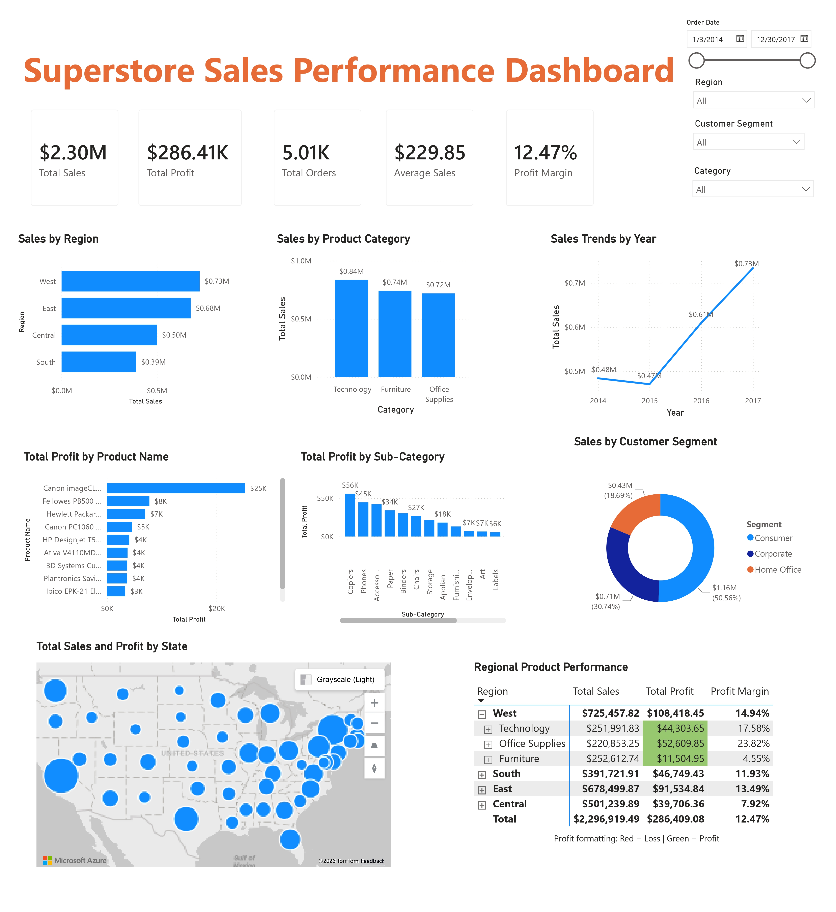

# 📊 Superstore Sales Business Intelligence Dashboard

## Project Overview

This project was completed as part of the Analyst Lab Africa Data Analytics Programme.

The objective was to design an executive Business Intelligence dashboard using Microsoft Power BI to help management monitor sales performance, profitability, customer behaviour and regional performance.

The dashboard transforms raw retail transaction data into meaningful insights that support strategic decision-making.

---

## 📌 Business Problem

Management needed a dashboard that could answer questions such as:

- How is the business performing overall?
- Which regions generate the most sales and profit?
- Which customer segments contribute the most revenue?
- Which product categories perform best?
- Which products are the most profitable?
- What trends can be observed over time?

---

## 📂 Dataset

**Dataset:** Superstore Sales Dataset

The dataset contains information on:

- Orders
- Customers
- Products
- Sales
- Profit
- Regions
- Categories
- Dates

---

## 📈 Dashboard Preview



---

## Dashboard Features

- Executive KPI cards
- Sales analysis
- Profit analysis
- Regional performance
- Customer segment analysis
- Product category analysis
- Sales trends
- Interactive filters

---

## Key Insights

- The West region generated the highest sales and profit.
- Consumer customers contributed more than half of total revenue.
- Technology was the highest-performing product category.
- Some sub-categories, including Tables, Bookcases and Supplies, were operating at a loss.

---

## Business Risks

- Low profitability in the Central region.
- Heavy reliance on Consumer customers.
- Low margins in the Furniture category.
- Continued losses in certain product sub-categories.

---

## Business Opportunities

- Expand investment in Technology products.
- Apply successful strategies from the West region to other regions.
- Prepare for increasing demand through inventory planning.
- Improve profitability of loss-making sub-categories.

---

## Recommendations

- Improve profitability in the Central region.
- Invest further in Technology products.
- Review pricing strategies for Furniture.
- Increase engagement with Corporate and Home Office customers.
- Investigate loss-making product lines.

---

## 🛠️ Tools Used

- Microsoft Power BI
- Power Query
- DAX
- Microsoft Excel

---

## Repository Structure

```text
data/
dashboard/
reports/
README.md
```

---

## 👤 Author

**Claudia Moyo**

Aspiring Data Analyst | Business Intelligence | Healthcare Analytics

Data Analytics Intern – AnalystLab Africa

LinkedIn: www.linkedin.com/in/claudia-moyo
